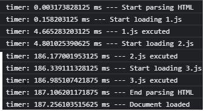
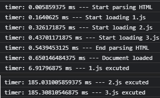
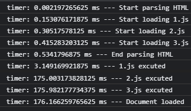

#### HTML 标签

编码简约

##### meta 标签使用

- 页面定时刷新（如果你只是想实现页面的定时刷新或跳转（比如某些页面缺乏访问权限，在 x 秒后跳回首页这样的场景）建议你可以实践下 meta 标签的用法。）

```html
<!-- 5s后跳转到同源下的table.html页面 -->
<meta http-equiv="Refresh" content="5; URL=table.html" />
```

- 设置 keywords 关键字和页面描述，用于搜索引擎查询

```html
<meta http-equiv="keywords" content="keyword1,keyword2,keyword3" />
<meta http-equiv="description" content="This is my page" />
```

##### 消息提醒

HTML5 标准发布之前，浏览器没有开放图标闪烁、弹出系统消息之类的接口，只能借助一些 Hack 的手段，比如修改 title 标签来达到类似的效果（HTML5 下可使用 Web Notifications API 弹出系统消息）。

```js
let msgNum = 1; // 消息条数
let cnt = 0; // 计数器
const inerval = setInterval(() => {
  cnt = (cnt + 1) % 2;
  if (msgNum === 0) {
    // 通过DOM修改title
    document.title += `聊天页面`;
    clearInterval(interval);
    return;
  }
  const prefix = cnt % 2 ? `新消息(${msgNum})` : "";
  document.title = `${prefix}聊天页面`;
}, 1000);
```

通过模拟消息闪烁，可以让用户在浏览其他页面的时候，及时得知服务端返回的消息。

HTML5 Notifications API

允许网页或应用程序在系统级别发送在页面外部显示的通知，Notification 生成的消息不依附于某个页面，仅仅依附于浏览器，避免传统本页面内接收消息的方式无法跨页面的问题。

##### 性能问题

针对经常出现的问题，如渲染速度慢，请求时间长等，可以通过合理的使用标签解决

- script 标签：调整加载顺序提升渲染速度
  浏览器渲染引擎在遇到`<script>`标签时，通过网络加载，加载完成后会切换到 JavaScript 引擎去执行相应代码，执行完成后再次切换回渲染引擎继续渲染。script 出现会中断 HTML 加载，且 script 会顺序的加载、执行，所有 script 执行完成后再解析 HTML。

  
  通过设置 script 标签属性解决

  - async：立即请求文件，但不阻塞渲染引擎，而是文件加载完毕后阻塞渲染引擎并立即执行文件内容。HTML 解析和 script 下载同步进行，script 执行会中断 HTML 解析；script 执行顺序和 tag 出现顺序不一定相同；script 可能会在 document loaded 之后执行。

  

  - defer：立即请求文件，但不阻塞渲染引擎，等到解析完 HTML 之后再执行文件内容。HTML 解析和 script 下载同步进行；script 会在 HTML 解析完成后和 document loaded 之前执行，且执行顺序和 tag 出现顺序一致。

  

  - HTML5 标准 type 属性，对应值为“module”。让浏览器按照 ECMA Script 6 标准将文件当作模块进行解析，默认阻塞效果同 defer，也可以配合 async 在请求完成后立即执行

- link 标签

  - dns-prefetch：设置 rel 属性值为“dns-prefetch”时，会对某个域名进行解析并缓存，并请求同域名资源时，可省去 DNS 查询 IP 的过程，减少时间损耗。
  - preconnect：让浏览器在一个 HTTP 请求正式发给服务器前预先执行一些操作，这包括 DNS 解析、TLS 协商、TCP 握手，通过消除往返延迟来为用户节省时间。
  - prefetch/preload：两个值都是让浏览器预先下载并缓存某个资源，但不同的是，prefetch 可能会在浏览器忙时被忽略，而 preload 则是一定会被预先下载。
  - prerender：浏览器不仅会加载资源，还会解析执行页面，进行预渲染。

  设置 dns-prefetch 可减少域名解析时间，设置 preconnect 可减少 TCP 连接等时间消耗，通过 prefetch/preload 可以让资源提前下载，使用的时候直接使用，而 prerender 可以加载资源同时预渲染，省去渲染页面的时间。

#### DOM

DOM 主要由三部分构成：DOM 节点、DOM 事件、选择区域（一般用于富文本编辑类业务）

##### DOM 节点

- 标签
  标签是 HTML 的基本单位，比如 p、div、input
- 元素
  节点是 DOM 树的基本单位，有多种类型，比如注释节点、文本节点
  元素是节点中的一种，与 HTML 标签相对应，比如 p 标签会对应 p 元素。

  ```html
  <p>亚里士多德</p>
  ```

  “p” 是标签， 生成 DOM 树的时候会产生两个节点，一个是元素节点 p，另一个是字符串为“亚里士朱德”的文本节点。

##### DOM 操作耗时

1. 线程切换
   浏览器包括渲染引擎（浏览器内核）和 JavaScript 引擎，他们都是单线程运行。因此开发方便，避免了多线程下的死锁、竞争等问题，但同时失去了并发能力。

   浏览器为避免两个引擎同时操作页面导致冲突问题，增加了一个机制，同一时间只有一个引擎在运行，另一个被阻塞。操作系统进行线程切换时需要保存上一个线程执行时的状态信息并读取下一个线程的状态信息，也就是上下文切换，这个操作相对而言比较耗时。

   每次 DOM 操作就会引发线程的上下文切换——从 JavaScript 引擎切换到渲染引擎执行对应操作，然后再切换回 JavaScript 引擎继续执行，这就带来了性能损耗。单次切换消耗的时间是非常少的，但是如果频繁地大量切换，那么就会产生性能问题。

   比如下面的测试代码，循环读取一百万次 DOM 中的 body 元素的耗时是读取 JSON 对象耗时的 10 倍。

   ```js
   // 测试次数：一百万次
   const times = 1000000;
   // 缓存 body 元素
   console.time("object");
   let body = document.body;
   // 循环赋值对象作为对照参考
   for (let i = 0; i < times; i++) {
     let tmp = body;
   }
   console.timeEnd("object"); // object: 1.8681640625ms

   console.time("dom");
   // 循环读取 body 元素引发线程切换
   for (let i = 0; i < times; i++) {
     let tmp = document.body;
   }
   console.timeEnd("dom"); // dom: 15.851806640625ms
   ```

   
   虽然这个例子比较极端，循环次数有些夸张，但如果在循环中包含一些复杂的逻辑或者说涉及到多个元素时，就会造成不可忽视的性能损耗。

2. 重新渲染

   网页生成过程

   1. 解析 HTML 文档为 DOM 树
   2. 解析 css 文件为 CSSOM 树
   3. 结合 DOM 树和 CSSOM 树，生成一棵渲染树(Render Tree)
   4. 生成布局（flow），即将所有渲染树的所有节点进行平面合成
   5. 将布局绘制（paint）在屏幕上

   重排 reflow 和重绘 repaint 是页面渲染过程中最耗时的两步骤，DOM 操作涉及改变元素的几何信息（位置和大小），浏览器需要重新计算元素的位置，并重新排列，这个过程称为重排；改变元素的外观，但没有改变布局，重新把元素外观绘制出来的过程，叫做重绘。

   可能会影响到其他元素排布的操作就会引起重排，继而引发重绘，比如：

   - 修改元素边距、大小
   - 添加、删除元素
   - 改变窗口大小

   与之相反的操作则只会引起重绘，比如：

   - 设置背景图片
   - 修改字体颜色
   - 改变 visibility 属性值

#### DOM 事件

种类：键盘事件、鼠标事件、表单事件等

- 防抖
  函数防抖是函数短时间内连续触发时，在规定时间内，函数只会执行一次

  ```js
  function debounce(fn, delay) {
    let timer = null;
    return function (...args) {
      timer && clearTimeout(timer);
      timer = setTimeout(() => {
        fn.apply(this, ...args);
      }, delay);
    };
  }
  ```

- 节流
  函数节流是短时间内大量触发同一时间，在函数执行一次之后，在指定的时间内不再被执行，直到过了这段时间才重新生效

  ```js
  function throttle(fn, delay) {
    let lastTime = 0;
    return function (...args) {
      const currentTime = new Date().getTime();
      if (currentTime - lastTime > delay) {
        fn.apply(this, ...args);
        lastTime = currentTime;
      }
    };
  }
  ```

  区别：防抖函数限制多长时间才能执行一次，节流函数限制多长时间必须执行一次，一个限制上限，一个限制下限，与防抖相比，节流函数最主要的不同在于它保证在指定时间内至少执行一次函数

- 代理（事件代理或事件委托）

  - DOM 事件流

    - 捕获阶段：从 window 进入事件目标阶段
    - 目标阶段：目标阶段
    - 冒泡阶段：从事件目标回到 window

  - 事件捕获
    事件发生时，在捕获阶段，事件会从最外层元素逐级往下执行响应函数
  - 事件冒泡
    事件发生时，先触发目标元素的事件响应函数，再逐级向上执行父元素的事件响应函数，直到 window 停止

    事件委托就是利用事件冒泡，只指定一个事件处理程序，就可以管理某一类型的所有事件。
    事件委托：不监听元素 C 自身，而是监听其祖先元素 P，然后判断 e.target 是不是该元素 C（或该元素的子元素）

DOM 事件标准

代码如何抽象成公共函数？

#### 布局

版心：内容所在的区域

单列布局

两列布局

三列布局

共同步骤

垂直布局

栅格布局的列数

#### css 代码管理

管理样式文件的作用是让开放人员更方便的维护代码，样式文件进行分类，将相关的文件放在一起

全局样式、公共样式

组件样式

样式文件管理模式

避免样式冲突

BEM block element modify

高效复用样式

CSS in JavaScript

#### 手写 css 预处理

主要实现功能：

- 用空格和换行符代替花括号、冒号和分号
- 支持选择器的嵌套组合
- 支持以'$'符号开头的变量定义和使用

编译器的工作流程：

1. 解析(parsing)

   - 词法分析
     词法分析就是将接收到的源代码转换成令牌，完成这个过程的工具叫做词法分析器
   - 语法分析
     代码令牌化之后会进入语法分析，会将之前的令牌转换为一种带有令牌关系描述的抽象表示，即 AST 抽象语法树，完成这个过程的工具叫语法分析器

2. 转换(Transformation)
   代码解析为 AST 抽象语法树后，通过转换器进一步修改，便于代码生成
3. 代码生成(Code Generation)
   根据转换后的 AST 生成目标代码

代码实现：

1. 词法分析
   令牌对象包括：变量（变量定义和使用）、变量值、选择器、属性和属性值，由于缩进会对语法分析产生影响，所以也要加入令牌对象

   ```js
   {
    type: "variableDef" | "variableRef" | "selector" | "property" | "value", //枚举值，分别对应变量定义、变量引用、选择器、属性、值
    value: '', // token字符串，即被分解的字符串
    indent: number // 缩进空格数，需要根据它判断从属关系
   }
   /*
    variableDef，以“$”符号开头，该行前面无其他非空字符串；
    variableRef，以“$”符号开头，该行前面有非空字符串；
    selector，独占一行，该行无其他非空字符串；
    property，以字母开头，该行前面无其他非空字符串；
    value，非该行第一个字符串，且该行第一个字符串为 property 或 variableDef 类型。
    */
   ```

   ```js
   function tokenize(text) {
     return text
       .trim()
       .split(/\n|\r\n/)
       .reduce((tokens, line, idx) => {
         const spaces = line.match(/^\s+/) || [""];
         const indent = spaces[0].length;
         const input = line.trim();
         const words = input.split(/\s/);
         let value = words.shift();
         if (words.length === 0) {
           tokens.push({
             type: "selector",
             value,
             indent,
           });
         } else {
           let type = "";
           if (/^\$/.test(value)) {
             type = "variableDef";
           } else if (/^[a-zA-Z-]+$/.test(value)) {
             type = "property";
           } else {
             throw new Error(
               `Tokenize error:Line ${idx} "${value}" is not a vairable or property!`
             );
           }
           tokens.push({
             type,
             value,
             indent,
           });
           while ((value = words.shift())) {
             tokens.push({
               type: /^\$/.test(value) ? "variableRef" : "value",
               value,
               indent: 0,
             });
           }
         }
         return tokens;
       }, []);
   }
   ```

2. 语法分析
   将词法分析得到的令牌数组转换为抽象语法树，树结构具有层级关系（选择器与选择器、选择器与属性存在层级关系）

   ```js
   {
     type: 'root',
     children: [{
      type: 'selector',
      value: 'string',
       rules: [{
         property: 'string',
         value: 'string'[],
       }],
       indent: number,
       children: []
     }]
   }
   ```

#### 浏览器如何渲染页面

Html 文档转换为 DOM 的过程

1. 字节流解码
   浏览器通过 http 请求获取文档内容为字节数据，需要通过“编码嗅探算法”确定字符编码，再根据字符编码将字节码解码生成字符数据（代码）
2. 输入流预处理
   字符数据进行统一格式化，字符流进入解析时需要一些预处理操作，比如将换行符转换为统一的格式
3. 令牌化
   字符数据转换为令牌：类似状态机，根据状态和接收到的字符更新下一个状态
   解析 HTML 为 DOM 树：最终生成简单的 DOM 树
4. 构造 DOM 树
   浏览器创建解析器的同时会创建 Document 对象。在树构建阶段，Document 作为根节点被不断地修改和扩充。标记步骤产生的令牌会被送到树构建器进行处理。HTML 5 标准中定义了每类令牌对应的 DOM 元素，当树构建器接收到某个令牌时就会创建该令牌对应的 DOM 元素并将该元素插入到 DOM 树中。
   
   渲染引擎同时会解析 CSSOM 树，有了 DOM 树和 CSSOM 树就可以渲染页面了
5. 构建渲染树
   DOM 树和 CSSOM 树需要合并为一颗渲染树，从 DOM 树的根节点进行遍历，然后在 CSSOM 树上找到每个节点对应的样式；遍历节点会忽略一些不需要渲染的节点
6. 布局
   计算元素的大小及位置，布局完成会输出对应的“盒子模型”，精确捕获每个元素的确切位置和大小，将所有的相对值转换为屏幕上的绝对像素
7. 绘制
   绘制是将渲染树中的每个节点转换成屏幕上的实际像素的过程

#### JavaScript 数据类型

- 基础类型
  undefined：只有 undefined 一个值

  ```js
  var a: // undefined 引用已声明未初始化的值
  var o = {}; o.a // undefined 引用未定义对象属性
  (() => {})() // undefined 执行无返回值函数
  void 0; // undefined 执行void表达式
  window.undefined // undefined 全局常量window.undefined或undefined
  ```

  Null：只有唯一的 null，表示空值，null 是 javascript 保留关键字
  Boolean：true 或 false
  Number：NaN（not a number） infinity（无穷大）
  String
  Symbol：ES6 新引入的数据类型，表示唯一的常量

- 引用类型
  Object

区别是：基础类型被拷贝时是“值引用"，而引用类型是“址引用”

类型转换

装箱操作和拆箱操作

Object 键值对集合
深浅拷贝

#### 函数是 javaScript 一等公民

js 中函数很复杂，可以有属性，也可以被赋值给一个变量，还可以作为参数传递，所以让它称为 JavaScript 的”一等公民”

- this 关键字
  this 指代“函数执行的上下文对象”，这个对象值“调用它”的对象，如果这个对象不存在则指向全局对象（严格模式下为 undefined）
  箭头函数的 this 继承自上层的 this
  箭头函数和普通函数对比：

  1. 不绑定 arguments 对象，所以箭头函数内不能访问 arguments
  2. 不能用作构造器，就是不能通过 new 来创建实例
  3. 默认不会创建 prototype 原型属性
  4. 不能用作 Generator 函数，不能使用 yeild 关键字

  原型和原型链
  原型是对象的属性，包括被称为隐式原型的`__proto__`属性和被称为显示原型的 prototype 属性

  ```js
  var a = {}; // 创建实例时隐式原型会自动指向构造函数的显示原型 显示原型是内置对象的默认属性
  a.__proto__ === Object.prototype; // true
  var b = new Object();
  b.__proto__ === a.__proto__; // true
  ```

- new 操作符实现了什么
  new 操作符在创建实例的时候会自动创建隐式原型,下面的代码通过 new 关键字创建了一个函数 F() 的实例。

  ```js
  function F(init) {}
  var f = new F(args);
  ```

  new 的过程

  1. 创建一个新的空对象
  2. 将构造函数的作用域赋给新对象 （因此 this 就指向了新对象）
  3. 执行构造函数中的代码（为这个新对象添加属性）
  4. 返回新对象

  [具体实现](https://github.com/wang1xiang/learning-notes/blob/master/%E9%9D%A2%E8%AF%95%E7%9B%B8%E5%85%B3/js/myNew.js)

- 怎么实现原型链实现多层继承
  ES6 直接使用 extends 实现,ES5 使用原型链的方式实现
  typeof 和 instanceof
- 作用域
  作用域是指赋值、取值操作的执行范围，通过作用域机制可以有效地防止变量、函数的重复定义，以及控制它们的可访问性。
  虽然在浏览器端和 Node.js 端作用域的处理有所不同，比如对于全局作用域，浏览器会自动将未主动声明的变量提升到全局作用域，而 Node.js 则需要显式的挂载到 global 对象上。又比如在 ES6 之前，浏览器不提供模块级别的作用域，而 Node.js 的 CommonJS 模块机制就提供了模块级别的作用域。但在类型上，可以分为全局作用域（window/global）、块级作用域（let、const、try/catch）、模块作用域（ES6 Module、CommonJS）及本课时重点讨论的函数作用域。
  全局、块级、函数
  命名提升
  var 关键字声明的变量及创建命名函数时,js 解析器在解析执行时会提升到作用域顶部,这就是命名提升
  变量命名提升允许在同级作用域提前使用变量,函数命名提升则是可以提前调用

  ```js
  console.log(a); // undefined
  var a = 1;
  console.log(a); // 1
  console.log(b); // ReferenceError: b is not defined
  let b = 2;
  ```

- 闭包
  函数内部访问函数作用域时就会产生闭包
  闭包缓存对象

  ```js
  const SingleStudent = (function () {
    let _student = "";
    function Student() {}
    return function () {
      if (_student) {
        return _student;
      }
      _student = new Student();
      return _student;
    };
  })();
  const s = new SingleStudent();
  const s2 = new SingleStudent();
  s === s2; // true
  ```

#### 代码没有按照编写的顺序执行

异步 非阻塞
同步 阻塞
事件循环 宏任务和微任务
处理异步
promise async...await...

<!-- [].reduce(item => {

}) -->

异步并行
Promise.all([...])
Promise.allSelected([...])
Promise.race([...])

#### 代码复用

##### ES6 模块

- 特点:强制自动采用严格模式;浏览器需添加 type="module"才能正确解析;为了与 NodeJs 默认的 CommonJs 规范区分,在 NodeJs 中使用时需要将后缀改为.mjs

- 重要特性

  1. 值引用
     export 输出的接口与其对应的值是动态绑定关系,即通过该接口可以获取模块内部实时的值,相当于浅拷贝;export default 是深拷贝

     [测试用例]()

     ```js
     // a.js
     export var a = "a";
     var b = "b";
     setTimeout(() => (a = "aa"), 500);
     setTimeout(() => (b = "bb"), 500);
     export default b;

     // b.js
     import b, { a } from "./a.js";
     console.log(a, b); // 'a, b'
     setTimeout(() => console.log(a, b), 1000); // 'aa, b'
     ```

  2. 静态分析
     指不需要执行代码，只从字面量上对代码进行分析，方便优化代码体积，比如通过 tree-shaking 操作消除模块中没有被引用的无用代码

- import 动态模块
  ES2020 提出 import()函数支持动态导入模块，返回 Promise 对象

  ```js
  import(`./section-modules/${link.dataset.entryModule}.js`)
    .then((module) => {
      module.loadPageInto(main);
    })
    .catch((err) => {
      main.textContent = err.message;
    });
  ```

  import()函数违反上面静态说明的所有要求，并提供了更强大的功能特性

  - 违反首部声明要求，意味着可以在代码运行时按需加载模块，用于首屏优化、路由或组件按需加载等
  - 违反变量或表达式要求，可以根据参数动态加载模块
  - 违反嵌入语句逻辑规则，可想像空间更大，比如可以通过 Promise.race 方式同时加载多个模块，选择加载速度最优模块来使用，从而提高性能

##### CommonJS

- 定义和引用
  规定每个文件就是一个模块，有独立的作用域。每个模块对应一个 module 对象，包括以下属性：

  - id：模块标识符，通常是带有绝对路径的模块文件名
  - filename：模块的文件名，带有绝对路径
  - loaded：返回布尔值，表示模块是否已经加载
  - parent：表示调用该模块的模块，对象
  - children：表示该模块要用到的模块，数组
  - export：表示模块对外输出的值

  引用模块使用 require 函数，作用是读入并执行一个 javascript 文件，返回该模块的 exports 对象

- 特性
  采用值拷贝和动态说明

  ```js
  // a.js
  let a = "a";
  setTimeout(() => (a = "a"), 500);
  module.exports = a;
  // b.js
  let a = require("./a.js");
  console.log(a); // a
  setTimeout(() => console.log(a), 1000); // a
  ```

##### AMD 异步加载

ES6 模块出现之前，AMD(Asynchronous Module Definition,异步模块加载)是一种很热门的浏览器模块化方案
定义全局函数 define

```js
// id: 模块名称
// dependencies：定义所依赖的模块
// factory：模块初始化要执行的函数或对象
defined(id?, dependencies?, factory);
// 创建一个名为“alpha”的模块，依赖了 require、exports、beta 3 个模块，并导出了 verb 函数。
define("alpha", ["require", "exports", "beta"], function (
  require,
  exports,
  beta
) {
  exports.verb = function () {
    return beta.verb();
  };
});
```

##### CMD（Common Module Definition，通用模块定义）

CMD 整合 CommonJs 和 AMD 规范的特点，最大的特点就是懒加载，不需要在定义模块的时候声明依赖，可以在模块执行时动态加载模块

##### UMD（Universal Module Definition，统一模块定义）

其实并不是模块管理规范，而是带有前后端同构思想的模块封装工具。通过 UMD 可以在合适的环境选择对应的模块规范

- 先判断是否支持 Node.js 模块格式（exports 是否存在），存在就是 Nodejs 模块格式
- 再判断是否支持 AMD（defined 是否存在），存在则使用 AMD 方式加载模块
- 若前两个都不存在，则将模块公开到全局（window 或 global）

##### ES5 标准下如何编写模块

模块的核心就是创建独立的作用域，使用立即执行函数：通过作用域链的特性，外部作用域无法访问内部作用域的变量，可以做到保护模块内的变量的作用，然后通过把需要公开的属性和方法挂载到 window 对象上，就实现了一个模块的封装

#### js 不适合大型项目

typeScript

#### 浏览器如何执行 JS 代码

- 解析
  词法分析、语法分析
- 解释
- 优化

##### 内存管理

JavaScript 内存分为堆（Heap）和栈（Stack）

- 栈
  栈是一个临时存储空间，栈中的数据都是轻量的，主要存储局部变量和函数调用，像基础类型的局部变量都会在栈中创建，对象类型的局部变量会存储在堆中，栈中只保存它的引用地址，也就是常说的浅拷贝原因。全局变量及闭包变量也只存储引用地址。
  对于函数，v8 引擎创建了“调用栈（Call Stack）”来记录函数调用过程。函数调用就会被推入调用栈中，并创建对应的“栈帧（Stack Frame）”用来保存函数的局部变量及执行语句，执行结束后，对应的栈帧就会被销毁。
  当分配的调用栈空间被占满时，就会引发“栈溢出”错误
- 堆
  堆空间的数据比较复杂，划分为五个区域：代码区（Code Space）、Map 区（Map Space）、大对象区（Large Object Space）、新生代（New Object）、老生代（Old Space)

#### 区分浏览器的进程（Process）与线程（Thread)

进程是操作系统进行资源分配和调度的基本单位，线程是操作系统进行运算的最小单位。一个程序至少有一个进程，一个进程至少有一个线程。线程需要由进程来启动和管理。

以 Chrome 为例，当打开标签页时，启动了下面几个进程

1. 浏览器进程
   主进程负责界面显示（地址栏、导航栏、书签等）、处理用户事件、管理子进程等
2. GPU 进程
   处理来自其他进程的 GPU 任务，比如来自渲染进程或扩展进程的 CSS3 动画效果和来自浏览器进程的界面绘制等
3. Network Service 进程
   负责页面网络资源加载
4. V8 代理解析工具进程
   Chrome 支持使用 JavaScript 来写连接代理服务器脚本，称为 pac 代理脚本
5. 渲染进程
   浏览器会为每个标签页启动一个渲染进程，所以它与其它进程不同，它不是唯一的
   渲染进程的任务是将 HTML、CSS 和 JavaScript 转化为⽤户可以与之交互的网页，每个渲染进程都会启动单独的渲染引擎线程和 JavaScript 引擎线程。
6. 扩展程序进程
   主要是负责插件的运⾏，和渲染进程一样，也不是唯一的，浏览器会为每个插件都启动一个进程。这样的设计也是从安全性和稳定性考虑。

#### 深入理解网络协议

- HTTP/0.9
  只能传输文本内容 HTML
- HTTP/1.0
  增加头部设定，以键值对形式设置，请求头通过 Accept 字段告诉服务端可以接受的文件类型，响应头通过 Content-Type 字段告诉浏览器返回的文件类型
- HTTP/1.1
  HTTP/1.0 每进行一次通信，需要经历建立连接、传输数据和断开连接三个阶段，当一个页面引用较多外部文件时，这个建立连接和断开连接的过程会增加大量网络开销
  1999 年推出 HTTP/1.1 增加创建持久连接的方法 Connection: Keep-Alive，主要实现是当一个连接传输完成时，并不是马上进行关闭，而是继续复用它传输其他请求的数据，直到浏览器或服务端要求断开连接为止

  - TCP 三次握手建立连接
    TCP 在建立连接之前，客户端和服务端会发送三次数据，来判断双方的发送和接受能力
    1. 第一从握手，客户端处于 CLOSED 状态，服务端处于 LISTEN 状态，客户端向服务端发送 SYN 报文，并指明客户端的初始化序列号 ISN，此时客户端处于 SYN_SEND 状态
    2. 第二次握手，服务端接收到客户端的 SYN 报文，会返回自己的 SYN 报文作为应答，同时初始化服务端序列号 ISN，并将客户端发送的 ISN + 1 作为 ACK 一并返回，表示已接受到客户端的 SYN 报文，此时服务端处于 SYN_RECV 状态
    3. 第三次握手，客户端接收到服务端的 SYN 和 ACK 报文，接收服务端的 ISN + 1 作为 ACK 的值，表示已接受到服务端的 SYN 报文，此时客户端处于 ESTABLISHED 状态，服务端接收到 ACK 后，与处于 ESTABLISHED 状态，此时双方建立了连接
  - TCP 四次挥手断开连接
    1. 此时客户端和服务端同处于 ESTABLISHED 状态，客户端发送 FIN 报文，用于关闭和服务端的连接，此时客户端处于 FIN_WAIT_1 状态
    2. 服务端收到 FIN 报文，会把客户端的 ISN + 1 作为 ACK 报文的值并发送给客户端，表示已经收到客户端的报文了，此时服务端处于 CLOSE_WAIT 状态
    3. 如果服务端同意关闭连接，则向客户端发送一个 FIN 报文，并指定一个序列号，此时服务端处于 LAST_ACK 的状态
    4. 当客户端收到 ACK 报文时，处于 FIN_WAIT_2 状态。待收到 FIN 报文时发送一个 ACK 报文作为应答，并且把服务端的序列号值 +1 作为自己 ACK 报文的序列号值，此时客户端处于 TIME_WAIT 状态。等待一段时间后会进入 CLOSED 状态，当服务端收到 ACK 报文之后，也会变为 CLOSED 状态，此时连接正式关闭

- HTTP/2

  - HTTP/1.1 并发能力受到限制

    - 浏览器为了减轻服务器压力：限制同一个域下的 HTTP 连接数 6~8 个，所以在 HTTP/1.1 下会看到资源文件等待加载的状态，解决的方法是使用不同的域名加载文件
    - HTTP/1.1 自身问题：“队头阻塞”，虽然是持久连接，多个请求能公用一个 TCP 连接，但一个连接同一时刻只能处理一个请求，在当前的请求还没有结束之前，其他的请求只能处于“阻塞”状态

  - HTTP/2 新增二进制分帧提高传输效率
    不再使用 ASCLL 码作为传输，而是使用二进制数据。客户端发送请求时会将每个请求的内容封装成不同的带有编号的二进制帧，一并发送到服务端。服务端收到请求会将相同编号的帧合并为完整的请求信息。同样，服务端返回结果和客户端接收结果也遵循这个帧的拆分和组合的过程。
  - 多路复用
    由于二进制分帧，对于同一个域客户端只需与服务端建立一个连接即可完成通信需求，不再受限于浏览器的连接数限制，这种利用一个连接发送多个请求的方式称为“多路复用”
  - 通过压缩头部信息来减少传输体积
  - 通过服务推送来减少客户端请求

  HTTP/2 采用二进制分帧实现多路复用，也就是只有一个 TCP 连接用于进行数据传输，如果网络问题会导致所有数据都被阻塞。相反 HTTP/1.1 可以开启多个 TCP 连接，任何一个 TCP 出现问题都不会影响其他 TCP 传输。

- HTTP/3

HTTPS
证书机制

#### 如何让浏览器更快的加载网络资源

- gzip
- HTTP 缓存
  强制缓存和协商缓存
- ServiceWorker
  实现离线缓存

#### 浏览器同源策略与跨域方案

- CORS
- JSONP
- WebSocket
- 代理转发
- 页面跨域解决方案
  postMessage
  改域

#### 前后端如何有效沟通

REST
接口松散
数据冗余

GraphQL--图表查询语言
提供三种操作
查询（Query）

    - 别名
    - 片段
    - 内省

变更（Mutation）
订阅（Subscription）

GraphQL 与 typeScript 类型定义类似，在一些高级功能（联合类型和接口定义）上也有异曲同工之妙

数据操作－－解析器

#### 如何理解组件

1. vue 模板编译器解析过程

   - 解析 生成 AST
   - 优化 标记静态 AST 节点
   - 生成代码 遍历 AST 解析对应的 html

2. react 使用 jsx 编写

##### 虚拟 DOM

- 性能优化
- 跨平台

#### 路由放在前端的意义

浏览器 URL 变化时请求对应的网络资源,负责响应这个网络资源的服务就称为路由

前端路由重要基础:

1. 修改 URL 时不发送请求
   基于 hash 实现(hash 值得变化不会触发浏览器发送请求, 占用浏览器跳转功能)
   基础 history 实现(会向服务端发送请求,所以需设置服务端将所有 URL 请求转向前端页面)
2. 路由解析
   路由匹配 使用插件 path-to-Regexp
3. 路由生成
   通过配置的请求路径字符串和参数生成对应得请求路径

#### 组件通信--状态管理

- 父子组件通信
- 非父子组件

可预测
中心化
可调式

状态管理库实现原理

其他通信方式

1. 全局上下文
2. 事件监听 全局事件代理

#### 代码编译

webpack 入口
分别是通过命令行调用的 bin/webpack.js

- 检验配置项
  validateSchema
- 创建编译器
  createCompiler()返回 compiler
  4 种钩子函数
- 执行编译
  调用 compile 函数
  以及直接在代码中引用的 lib/webpack.js

#### 合理搭建前端项目

- 项目组织
- 代码规范

#### 前端性能优化

- 性能指标
  首屏绘制 FP
  FCP
  TTI
  TBT
  LCP

- 优化思路
  加载性能优化
  渲染性能优化

#### web 安全

- 跨站脚本（XSS） 存储型危害大
- 跨站请求伪造（CSRF） 冒用用户身份进行操作
- 点击劫持（ClickJacking） iframe 引用页面

#### Nodejs

libuv
网络 IO、文件 IO

#### 数据结构

- 数组
  通过索引来快速访问特定的元素
  HashTable FixedArray
- 栈
  先进后出（FILO）
- 队列
  先进先出（FIFO）
- 链表
  双向链表 单向链表
  跳跃表
- 树
  有限节点组成的层级
  深度遍历
  广度遍历

#### 算法

- 前端开发场景更关注页面效果及用户交互涉及数据计算的场景比较少
- 前端运行环境浏览器性能有限
- 在多端的系统中算法运用在后端会更加高效

1. 事件复杂度 根据执行次数来计算
2. 控件复杂度 根据临时变量大小来计算

Array.prototype.sort()顶层实现 TimSort

#### 编程方式

- 命令式编程

  - 面向过程
    以过程为中心，按照流程步骤逐个的分析每个问题
  - 面向对象
    把问题抽象为对象

- 声明式编程
  表示计算逻辑而无须谈论其控制流程，重点是需要完成的工作，而不是如何完成
  重点是需要完成的工作，而不是如何完成，这是与命令时编程唯一区别
  - 逻辑式编程
    通过设置答案需符合的规则来解决问题，而非设置步骤来解决问题
  - 数据驱动编程
    基于数据，程序语言由数据定义而非执行步骤
  - 函数式编程
    来源于数学，通过执行一系列的数学函数来得到结果
    纯函数：符合幂等性且无副作用 幂等：在相同的输入得到相同的输出 副作用：除了返回函数值之外，还对调用函数产生附加的影响例如修改全局变量等
    高阶函数：接受一个参数作为函数，返回另一个函数的函数
    柯里化：把接受多个参数的函数变为接收单一参数的函数

#### 设计模式

- 设计模式原则
  围绕类和接口两个概念提出的
  - 开闭原则：对扩展开放、对修改闭合
  - 里氏替换原则：使用父类的地方可以用它的任意子类进行替换
  - 依赖倒置原则：好的依赖关系是类依赖于抽象接口，而不是依赖于具体实现
  - 接口隔离原则：不应该依赖它不需要的接口
  - 迪米特原则：一个类对其他类知道的越少也好
  - 单一职责原则：应该有且仅有一个原因引起类的变更
- 设计模式分类
  - 创建型
    关注点如何创建和使用对象，对象的创建和使用进行分离，降低系统的耦合度
    抽象工厂模式 生成器模式 工厂方法模式 原型模式 单例模式
  - 结构型
    如何将类或对象组合在一起形成更大的结构
    适配器模式 桥接模式 组合模式 装饰器模式 外观模式 享元模式 代理模式
  - 行为型
    描述程序在运行时复杂的流程控制，描述多个类或对象之间怎么相互协作完成单个类或对象无法完成的任务
    责任链模式 命令模式 策略模式 解释器模式 迭代器模式 中介者模式 备忘录模式 观察者模式 状态模式 访问者模式 模板方法模式

#### serverless

由“server”和“less”组成，中文是无服务器意思，不是语言或框架，而是一种软件的部署方式，使用 serverless 可以直接使用云服务厂商提供的环境

- 从何而来
  一种构建和管理基于微服务框架的完整流程
- 组成
  Fass（Function as a service）：函数即服务
  Bass（Backend as a service）：后端即服务，集成了中间件
- 特点
  免维护
  费用
  深度绑定
  运行时长限制
  冷启动

- 应用场景
  阿里云的函数计算

#### 微前端与功能的可重用性

- 代码复用

  1. 复制粘贴
  2. 封装模块
  3. 打包成库 跨项目使用
  4. 提供服务 react 使用 vue

- 微前端
- 微前端应用场景
- 微前端核心思想
  - 技术无关
  - 环境独立 postcss css js 隔离沙箱机制
  - 原生优先
- 微前端架构模式
  - 在服务端集成微服务
  - 在浏览器端集成
